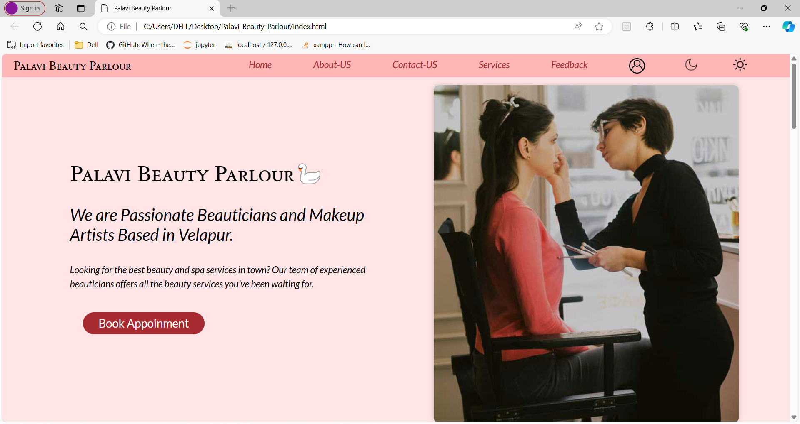
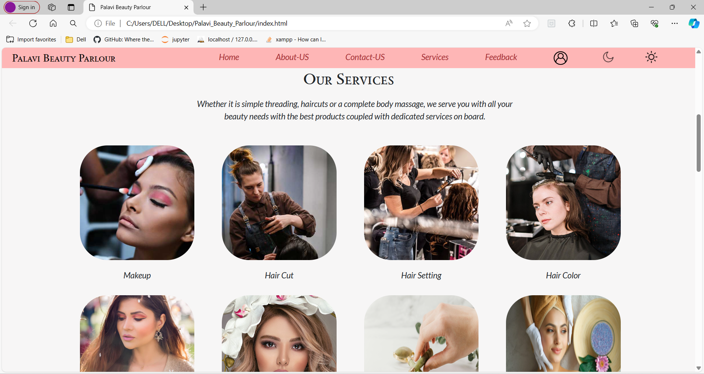
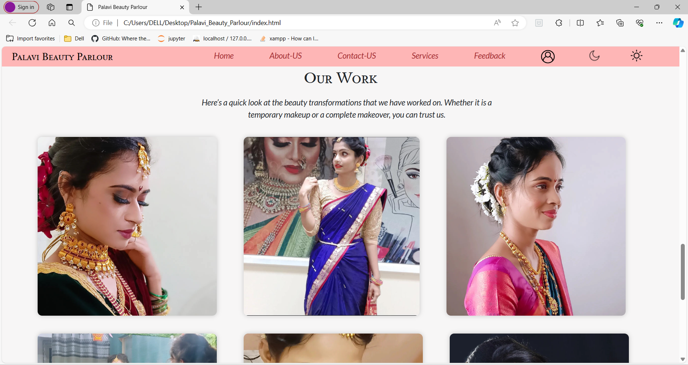
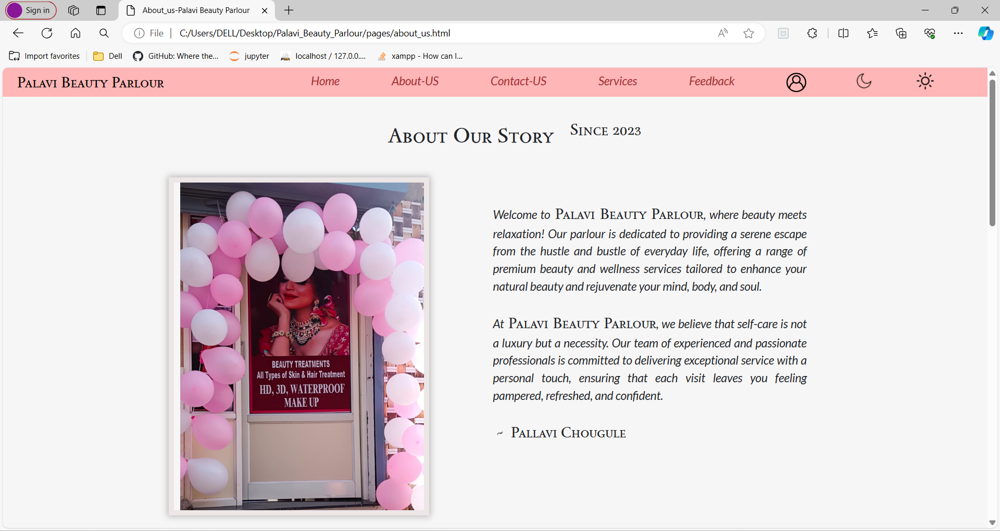
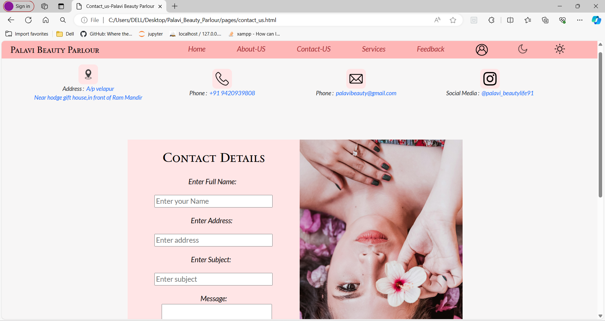
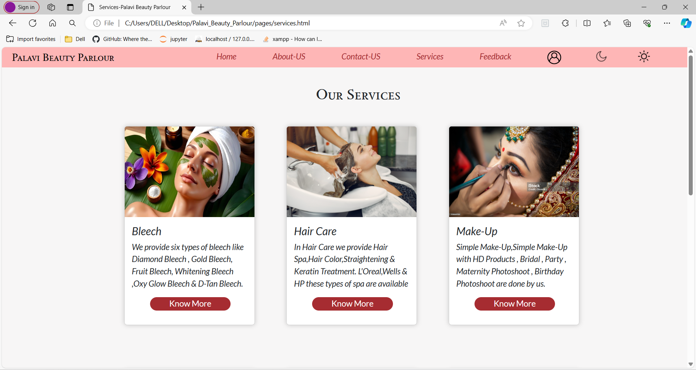

# Project-Name: Palavi_Beauty_Parlour

---
# Project-Title:  Palavi_Beauty_Parlour✨

---
Welcome to RJ's Html & CSS & JS First Individual Project . ** Palavi_Beauty_Parlour** ,where dreams unfold into seamless celebrations.Bringing out the beauty in you !

This Project is simply made by using HTML & CSS & JS. Weather you are Beginner Student to coding or Web Development this repository will be your go to resource for HTML, CSS and JS.

---
## Features
1. Expert in Plannig & Designing
2. Quality assurance
3. Exclusive offers
4. Affordable Pricing
5. Descent Organizing
---
### Home Page

---

---

---
### About Page

---
### Contact Page

---
### Services Page

---

## How to Contribute 🪴💻

We welcome contributions from the community to help us expand and improve this handbook if you would like to contribute follow the steps:

1. Fork the repository to your GitHub account.
2. Make your changes ,add new content or fix the existing issues.
3. Open pull request in this repository.

---
## Contributors

Made with [contrib.rocks](https://contrib.rocks).